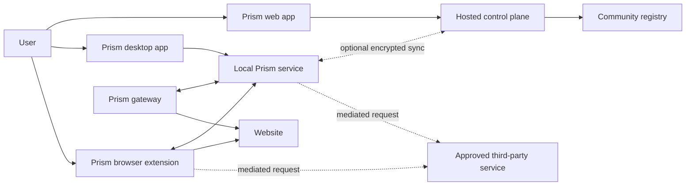
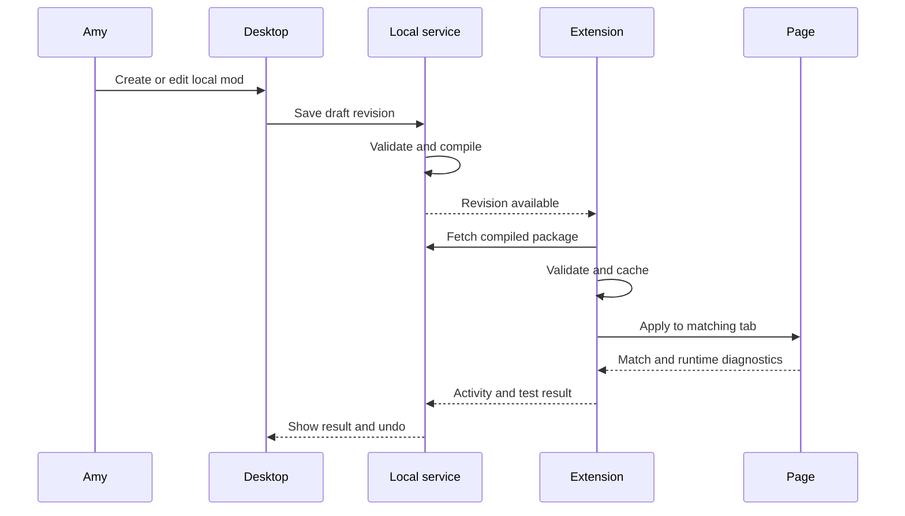

# Prism architecture

## Status

This document records the current product and architecture decisions derived from the Amy and Bob user stories. It describes the intended boundaries and trust model. It does not select an implementation language, UI framework, database or hosting provider.

**v1 delivery (ADR 0002):** the Chromium extension is the product. Native host, desktop UI, gateway, TV/IoT DNS, marketplace website, and Firefox-as-a-store-listing are deferred. Trust-model rules below still apply. Work queue: `Documentation/specs/2026-08-28-extension-v1-plan.md`.

Prism is one product with several enforcement components. It is not one process and does not force every type of policy through a proxy.

## Problem

Users currently combine DNS filters, VPNs, firewalls, ad blockers, style managers, userscript managers and single-purpose extensions. Each tool has its own configuration, update channel, permissions and exceptions.

The resulting problems are:

- Repeated configuration across browsers and devices.
- Broad and difficult-to-audit extension permissions.
- Arbitrary community JavaScript executing against sensitive pages.
- Network blockers that cannot handle first-party content or live page behaviour.
- Browser tools that cannot protect IoT devices or native applications.
- No unified explanation of what changed a page or blocked a request.
- No consistent per-site exception model.
- No safe local development path that leads to reviewed community publication.

Prism provides one policy system and enforces each decision at the narrowest capable layer.

## Product goals

Prism should:

- Let users establish global preferences for unwanted web behaviour.
- Support exact-origin and per-feature exceptions.
- Apply full website redesigns through constrained community mods.
- Import existing UserCSS and userscripts without describing arbitrary scripts as safe.
- Run locally without a Prism account or Prism-hosted service.
- Remain open source and fully usable without donation or subscription.
- Support immediate local authoring and browser hot reload.
- Offer optional encrypted cross-device synchronisation.
- Publish immutable, reviewed and signed community releases.
- Disclose exact third-party information flows before enabling them.
- Apply DNS, firewall and private-service policies outside the browser where appropriate (deferred past v1; see ADR 0002).
- Continue operating from validated local caches during service outages.

## Non-goals

Prism should not:

- Terminate or inspect arbitrary HTTPS traffic by default.
- Use a remote reverse proxy to present the general web under a Prism origin.
- claim that static scanning makes arbitrary JavaScript safe.
- silently upload private mods, browsing logs or page contents.
- allow community mods to execute unrestricted network requests.
- click advertisements, forge reward completion or circumvent service accounting.
- reimplement mature blocking, DNS or mesh-networking engines without a demonstrated need.
- promise that DNS or firewall filtering can identify content within encrypted first-party traffic.

## Architectural principles

### Local first

Local drafts, policies and activity records remain local by default. Hosted services are optional replicas and distribution services, not runtime dependencies.

### Default deny

A native Prism mod receives no page, storage, network or data-export capability unless its signed manifest declares that capability and the user grants it.

### Data, not remote code

The browser extension contains the reviewed execution primitives. Native Prism packages contain declarative data and optional compiled JavaScript that **only** calls those primitives (`prism.*`). Packages cannot add `fetch`, `eval`, DOM, or OS APIs. Native mod code runs without access to the page DOM in a sandboxed runtime. HTML parsing for cross-site extractors lives in the extension. The registry cannot introduce a new execution path without an extension release.

### Per-mod isolation

The extension may hold broad browser permissions, but mods do not inherit them. Prism enforces capabilities separately for each mod and revision.

### Semantic capabilities

Mods should request meaningful handles such as `ad-slot` or `youtube.currentVideo.id`, not unrestricted DOM traversal or arbitrary page JavaScript.

### Explicit information flow

Network access is a field-level egress contract. A user approves the destination, trigger, transmitted fields, derivation, frequency, response type and failure behaviour.

### Graceful degradation

Optional services define local fallback behaviour. A network-backed cosmetic feature must not make the underlying page or mod unusable when offline.

### Explainability and reversibility

Every effective page, network and site policy is inspectable. Users can identify the responsible rule, undo it and create a narrow exception.

## System context



v1 uses only `User --> Extension --> Page` and extension-mediated provider requests. Desktop, Service, Gateway, Web, Control, and Registry are deferred.

The solid local path remains useful without the hosted control plane. Dotted paths are optional.

## Components

### Local Prism service

Deferred in v1 (ADR 0002). When it exists, it is the preferred authority on devices with the desktop application installed. Until then the extension is the local state authority.

Responsibilities:

- Own the local mod, policy and revision database.
- Validate, compile and activate native mods.
- Store private drafts and bundled resources.
- Coordinate browser and gateway policy compilation.
- Provide a narrow Native Messaging bridge.
- Watch local mod workspaces and emit revision events.
- Maintain local capability grants and device identity.
- Replicate opted-in state to a self-hosted or managed controller.
- Keep privacy-sensitive activity logs local by default.

The service is not an arbitrary command runner for the browser extension. Its RPC surface must expose Prism operations, not shell or filesystem primitives.

### Desktop application

Deferred in v1. Later: management and authoring UI over the local service.

Responsibilities:

- Browse installed and community mods.
- Create local mod workspaces.
- Show schemas, examples, diagnostics and capability declarations.
- Support AI-assisted authoring without automatically sharing page data.
- Review before and after page changes.
- Configure global, site and device policies.
- Inspect exact network requests and data disclosures.
- Publish selected revisions.
- Manage synchronisation, devices, keys and backups.

The desktop UI must not become the sole runtime. Browser and gateway caches continue operating while it is closed.

### Browser extension

The extension is the browser enforcement point.

Responsibilities:

- Apply validated mods at `document_start` where possible.
- Observe client-side rendering, navigation and DOM mutation.
- Enforce paste, title, popup, autoplay, scroll-lock and modal policies.
- Apply CSS, semantic DOM transforms and complete redesign components.
- Cache active compiled packages and site exceptions.
- Broker optional host permissions.
- Execute field-level egress contracts.
- Validate and sanitise network responses before page use.
- Present current-page activity, undo and exception controls.
- Support immediate hot reload from the local service when a host exists; in v1, rebuild or reload the unpacked extension.
- Run restricted legacy userscripts in clearly labelled compatibility modes (after tracers).

v1: no Native Messaging. Page content scripts communicate with the extension service worker, which mediates capabilities. Later: Native Messaging to the desktop service, not proxied page traffic.

The extension does not rely on HTML injection by a local proxy.

### Prism gateway

Deferred in v1. The optional gateway enforces network and private-service policy. It does not block first-party HTTPS ads on a TV unless that TV's DNS path uses the gateway. The Windows app is not a Wi-Fi AP for other devices.

Responsibilities:

- DNS filtering and private DNS records.
- Domain, IP, port and device egress rules.
- Known telemetry and IoT phone-home blocking.
- Encrypted remote access and optional exit-node routing.
- Private service naming and reverse proxying for user-owned services.
- Per-device policy and logging.
- Optional direct execution of compiled network rules.

The gateway cannot identify arbitrary content inside HTTPS without interception. It must not imply that it can distinguish first-party ads, keylogging or legitimate API traffic solely from DNS or connection metadata.

Prism does not enable general TLS interception by default. A future explicit diagnostic mode would require a separate threat model and user consent.

### Hosted control plane

The hosted control plane is optional for runtime. Using Prism's replica of it is a convenience subscription, not a trust upgrade.

Responsibilities:

- Account and device coordination for people who opt into a hosted replica.
- Encrypted private state replication.
- Web-app management.
- Policy history and cross-device rollback.
- Managed DNS, optional relays and optional exit nodes.
- Public marketplace search (usable with no account).
- Publication workflow and author identity (usable with no subscription).
- Optional human verification as a registry label and queue, not as an install or run gate.
- Compatibility monitoring and notifications.

The control plane sends policy data, not arbitrary executable code. Clients validate signatures and capability compatibility before activation.

### Community registry and review service

The registry stores public packages and immutable releases.

Responsibilities:

- Content-addressed package storage.
- Publisher and registry signatures.
- Manifest and schema validation.
- Secret and provenance scanning.
- Capability-diff generation.
- Static policy checks.
- Response fixture and compatibility tests.
- Visual regression tests where appropriate.
- Moderation for deceptive UI, affiliate insertion and abuse.
- Revocation metadata without silently replacing a published artefact.
- Optional paid human verification, shown as a distinct label. Unverified public releases remain installable under the same capability model.

A registry signature proves provenance and review status. It does not claim that every permitted behaviour is desirable for every user or site. A paid verification label means reviewers spent time on that revision. It is not a substitute for capability disclosure or local enforcement.

## Enforcement layers

Prism routes policy to the narrowest suitable layer.

### DNS and firewall layer

Suitable for:

- Known advertising and tracking domains.
- Gambling, crypto, malware and category filtering.
- Known IoT telemetry destinations.
- Device-specific egress restrictions.
- Private DNS and service discovery.

Not suitable for:

- First-party advertisements sharing legitimate domains.
- DOM overlays, cookie banners and promotions.
- Website event interference.
- Full page redesigns.
- Inspecting encrypted request bodies.

### Browser network layer

Suitable for:

- Declarative request blocking and redirection.
- Tracking-parameter removal.
- Exact-host optional connector permissions.
- Request mediation for native mods.

### Browser page layer

Suitable for:

- Cosmetic filtering.
- First-party promotions.
- Paste and autofill interference.
- Modals, chatbot popups and scroll locks.
- Dynamic single-page applications.
- Semantic page data extraction.
- Complete visual redesigns.

### Hosted layer

Suitable for:

- Synchronisation.
- Package distribution.
- Compatibility monitoring.
- Optional privacy relays.

It is not the default execution environment for mods or browsing traffic.

## Mod model

### Native Prism mods

Native mods are packages interpreted by reviewed Prism runtime primitives. Orchestration JavaScript is allowed; new primitives are not.

A package contains:

- Stable package identity.
- Human-readable metadata and licence.
- Version and content hash.
- Publisher signature where applicable.
- Supported Prism runtime versions.
- Site and route scopes.
- Required capabilities.
- Optional capabilities.
- Optional compiled orchestration (`src/`) that may only call `prism.*`.
- Bundled resources.
- Optional egress contracts.
- Local settings schema.
- Failure and fallback behaviour.
- Test fixtures.

Native mods cannot call arbitrary `fetch`, `eval`, page JavaScript or operating-system APIs. They call `prism.*` only. Extractors that read third-party HTML run inside the extension and return JSON.

### Legacy compatibility

Prism supports migration rather than forcing users to abandon existing ecosystems.

Legacy content has three trust levels:

1. Native safe mods
   - Declarative and capability constrained.
   - Eligible for the strongest Prism safety statement.

2. Restricted legacy scripts
   - Existing userscripts run in an isolated user-script world where possible.
   - Grants, destinations, remote dependencies and execution world are constrained.
   - Compatibility and risk reduction are provided, but safety is not guaranteed.

3. Unrestricted legacy scripts
   - Explicitly enabled compatibility mode.
   - Clear warning that the script has Tampermonkey-like authority.
   - Disabled by default.

UserCSS imports receive a separate sanitisation pass. External URLs, imports, generated content, overlays and automatic update sources are disclosed or rejected according to policy. CSS is not treated as inherently harmless.

## Capability model

Capabilities are versioned runtime contracts. Each capability defines:

- Inputs visible to the mod.
- Operations the runtime performs.
- Data retained by the mod.
- Page and origin scope.
- User-facing disclosure.
- Audit events.
- Revocation and undo behaviour.

Initial capability families should include:

### Visual capabilities

- Apply sanitised style properties.
- Hide or restore matched elements.
- Reorder known semantic elements.
- Replace a semantic slot with a trusted component.
- Insert sanitised static content.
- React to runtime-managed DOM mutations.

### Behaviour capabilities

- Permit paste and standard input events.
- Prevent unsolicited popup creation.
- Freeze or constrain title mutation.
- Constrain autoplay.
- Release scroll locks.
- Invoke a predefined same-origin user action.

### Semantic data capabilities

- Read an approved public identifier such as a YouTube video ID.
- Enumerate visible semantic items with explicit limits.
- Read only the fields required by the primitive.

Public identifiers can still reveal sensitive browsing activity when transmitted as a sequence. Prism disclosures must explain the information revealed, not merely its source type.

### Storage capabilities

- Namespaced local settings.
- Bounded cache entries.
- No access to another mod's state.
- No access to browser passwords, cookies or arbitrary extension storage.

### Network capabilities

- Declarative block or allow rules.
- Field-level egress contracts.
- No arbitrary sockets or unrestricted requests.

## Field-level egress contracts

Safe mods never receive generic network access. They request a versioned connector executed by the Prism egress broker.

An egress contract declares:

- Exact HTTPS origin.
- Allowed method and path template.
- Trigger and maximum frequency.
- Intentional payload fields.
- Source and derivation of each field.
- Example values shown to the user.
- Batching limits.
- Credential, cookie and referrer policy.
- Redirect policy.
- Expected response type and size.
- Cache policy.
- Offline and failure fallback.
- Provider privacy-policy reference where available.

An illustrative contract is:

```yaml
optionalSources:
  - id: random-cats
    origin: https://images.example
    enabledByDefault: false
    purpose: Expand the bundled kitten image pool
    request:
      method: GET
      path: /random
      fields: []
      credentials: omit
      referrer: omit
      maximumFrequency: 10/hour
    response:
      types:
        - image/jpeg
        - image/png
        - image/webp
      maximumBytes: 2000000
    fallback: bundled-kittens
```

The broker must:

- Request only user-approved origins.
- Reject private, loopback and link-local destinations.
- Defend against DNS rebinding.
- Reject redirects to undeclared origins.
- Apply method, path, field, frequency and size constraints.
- Omit credentials and referrer unless separately justified and granted.
- Treat all responses as untrusted.
- Reject HTML, SVG and executable content when an image is expected.
- Decode, validate, strip metadata and preferably re-encode remote images.
- Cache responses according to the contract.
- Produce a local inspection event.

The user disclosure distinguishes:

- Data intentionally sent by Prism.
- Connection metadata necessarily visible to the provider, including source IP and request time.
- Data explicitly not sent.
- Information that the provider may infer from the request sequence.

Changing the origin, fields, derivation or trigger creates a capability diff and requires renewed approval.

### Example: dislike-count connector

A current-video connector should send the public video ID, not the full page URL, Google login, cookies or page contents.

A home-page connector that sends many visible video IDs is a separate capability. Although each ID is public, the collection can reveal a user's personalised feed and interests. It must be independently disclosed and enabled.

## Policy and exception model

Prism policies are composable rather than one global on/off switch.

A policy decision identifies:

- Feature or mod.
- Capability.
- Site origin and optional route.
- Device or device group.
- Duration.
- Source of the decision.
- Whether it synchronises.

Supported decisions include:

- Block.
- Allow once.
- Allow for this origin.
- Allow globally.
- Disable this mod on this origin.
- Disable this feature on this origin.

Recommended precedence is:

1. Hard runtime safety invariants.
2. Temporary user decision for the current session.
3. Exact-origin user exception.
4. Per-mod origin setting.
5. Device policy.
6. Global user policy.
7. Package default.

Prism must surface conflicts. Disabling a visual ad-replacement mod does not automatically disable a separate network ad blocker. The current-page panel explains each active rule and lets the user create a separate narrow exception.

## Core user flows

### Local development and hot reload



Unsigned local mods require explicit local-development mode and display a persistent local-build indicator. An AI authoring tool receives only files or sanitised page samples the user explicitly shares.

### Private cross-device use

- The local service remains authoritative for local drafts.
- The extension runs from its last validated cache.
- Users choose manual export, a self-hosted controller or managed encrypted sync.
- Private synchronisation is opt-in per collection or mod.
- Private sync does not make a mod public.
- Devices are individually authorised and revocable.

### Publication

- The user selects one immutable revision.
- Prism shows the exact files, assets and capabilities to be published.
- Secret, provenance, policy and compatibility checks run.
- Public metadata and a licence are required.
- The approved release is content addressed and signed.
- Later updates create new versions.
- A capability increase requires user reapproval during update.

### Installation

- The user reviews publisher, source, signature and capabilities.
- Required and optional capabilities are separate.
- Optional network sources remain disabled until separately enabled.
- The client validates package hash, signatures and runtime compatibility.
- The compiled package is cached locally.
- The mod executes without contacting the registry.

### Optional third-party source

- Bundled resources work by default.
- The user opens the optional source disclosure.
- Prism requests the exact browser host permission from a user gesture.
- The broker performs the constrained request.
- Invalid or unavailable responses fall back locally.
- Disabling the source removes its internal grant.
- Browser host permission is removed when no enabled feature still requires it.

### Per-site exception

- The user opens Prism on the affected site.
- Prism lists all visual, behavioural and network rules affecting that origin.
- The user disables one mod or feature for that origin.
- Prism restores reversible changes and reloads only if required.
- The exception remains local unless policy sync is enabled.

### Cryptojacking and resource abuse

As a user, I want Prism to block known cryptomining infrastructure before it can perform useful work in my browser or on another protected device.

The first cryptojacking protection release is list based:

- The gateway blocks known miner, pool and miner-CDN domains through compiled DNS policy.
- The browser extension blocks listed scripts, workers and WebSocket destinations through declarative network rules before those resources execute.
- Prism reuses maintained resource-abuse and cryptomining intelligence rather than creating a parallel miner-signature project.
- The current-page panel identifies the blocked destination, source list, enforcement layer and effective policy.
- A user can create a narrow exact-origin exception without disabling cryptomining protection globally.

The list-based release does not claim to detect a miner whose code and pool communication are both served from the visited origin. DNS and connection metadata cannot distinguish that traffic from legitimate first-party HTTPS traffic.

A later `page.resource-abuse` capability may detect and constrain first-party abuse in the browser. It should combine sustained computation, workers, WebAssembly and pool-like communication rather than treating any one signal as proof. It requires separate design and false-positive evaluation because games, media processing and local AI can exhibit the same individual signals.

Acceptance criteria for the list-based release are:

- A listed miner domain does not resolve for a device using the Prism gateway.
- A listed script or WebSocket request is cancelled by the extension before execution or connection.
- The activity record names the rule source and whether DNS or browser enforcement acted.
- An exact-origin exception does not weaken protection on unrelated origins.
- Gateway failure does not disable cached extension rules.
- Prism reports the first-party blind spot honestly and does not imply that TLS content was inspected.

## Storage and synchronisation

### Local state

The local service should be the single writer for:

- Mod source and immutable revisions.
- Compiled packages.
- Capability grants.
- Global and site policies.
- Device identity.
- Publication state.
- Private sync state.

The browser extension stores:

- Validated active packages.
- Minimal settings required while disconnected.
- Site exceptions needed at navigation time.
- Bounded runtime cache.
- Pending local activity events.

The extension must not require the desktop application to remain open.

### Hosted state

Public registry content is intentionally public.

Private managed sync must:

- Be end-to-end encrypted.
- Minimise plaintext metadata.
- Keep publication separate from private replication.
- Support device revocation and key rotation.
- Preserve immutable revision identity.
- Avoid synchronising browsing and request logs by default.

The exact key-management and conflict-resolution protocol remains to be designed.

### Extension-only devices

On devices that cannot run the local service:

- The extension operates from local browser storage.
- Anyone can import and export packages manually.
- Subscribers may synchronise directly with Prism's hosted replica.
- A later connection to the desktop service reconciles immutable revisions and explicit policy events.

## Security model

### Assets to protect

- Credentials and authentication state.
- Page contents and user input.
- Browsing history and semantic activity.
- Local files and operating-system access.
- Private mods and policies.
- Device and network topology.
- Registry signing keys.
- Update and synchronisation channels.

### Threat actors

- Malicious community author.
- Compromised publisher account.
- Compromised third-party connector.
- Hostile website interacting with a mod.
- Compromised registry or hosted control plane.
- Malicious local process.
- Supply-chain compromise of Prism itself.
- Well-intentioned mod with excessive or fragile behaviour.

### Required controls

- Store-reviewed extension runtime contains executable primitives.
- Content-addressed and signed packages.
- Immutable public releases.
- Capability enforcement at every runtime boundary.
- Narrow Native Messaging protocol restricted to the Prism extension ID.
- No generic shell, file or network RPC.
- Exact-origin optional browser permissions.
- Credentials omitted from third-party requests by default.
- Response sanitisation.
- SSRF and DNS-rebinding protection.
- Secret scanning before publication.
- Capability diffs and renewed approval.
- Local audit trail and reversible actions.
- Emergency package revocation that disables rather than replaces content.
- Reproducible builds where practical.
- Independent security review before enabling unrestricted legacy execution or native gateway privileges.

### Prompt fatigue

Prism should not prompt for every operation. It prompts when a capability is first enabled or materially changes. Exact operations remain visible in the local activity log.

### Browser permission limitation

Chrome permissions apply to the extension, not individual mods. Prism's per-mod boundary is therefore an application security boundary implemented and tested inside the extension. Browser host permissions should still be requested as narrowly as the combined active feature set permits.

## Reliability and failure behaviour

### Hosted service unavailable

- Installed mods continue from local cache.
- Local authoring and site policies continue.
- Publishing, marketplace search and managed sync pause.

### Desktop service unavailable

- Browser extension continues from cache.
- Hot reload and desktop editing pause.
- Extension records bounded pending activity locally.

### Third-party connector unavailable

- The declared fallback activates.
- Prism applies backoff and rate limiting.
- Users are not repeatedly prompted.

### Mod runtime failure

- Failure is isolated to that mod.
- Prism records the operation and restores reversible changes.
- Repeated failures can automatically pause the mod on the affected origin.

### Site incompatibility

- The current-page panel identifies the responsible mod or rule.
- The user can disable it for the exact origin.
- Compatibility telemetry is opt-in and sanitised.

### Registry compromise

- Existing content hashes prevent silent package replacement.
- Clients reject invalid signatures.
- Revocation metadata can pause affected releases.
- Private local mods remain unaffected.

## Openness, donations and subscriptions

Trust comes from being open source, inspectable, capability-disclosed, signed and locally enforced. Money is optional. Prism does not sell a safer product.

Donations buy an optional supporter badge (Immich-style). A badge has no product power: no extra capabilities, no weaker policy, no hidden code.

A subscription is for ongoing cost Prism actually incurs: hosted device sync, optional human verification labour, and later managed DNS or relay if those exist. Price may sit above direct cost (Bitwarden-style) so the surplus funds the free tier and ongoing development. People may subscribe for convenience, or to support the project. Neither is extra safety.

Hard gates:

- No capability, enforcement layer or local feature behind pay.
- Community publication and install work with no account and no subscription.
- Paid verification is a registry label and queue, not an install or run gate.
- Hosted sync is optional. Local and self-host remain first-class.
- No account is required to use Prism.
- Marketing and in-product copy must not imply that paying users are safer.

### Free local

- No account.
- Local desktop service and browser extension.
- Local mod creation and hot reload.
- Manual package import and export.
- Local policy and exception management.
- Existing package URLs where permitted.
- Public registry search, install and publication.
- No Prism-hosted sync dependency.

### Self-hosted

- User-operated controller and registry.
- Private synchronisation.
- Optional gateway coordination.
- User-controlled storage and signing policy.

### Hosted convenience (subscription)

- Encrypted cross-device sync on Prism's replica.
- Web management, device coordination and recovery.
- Managed DNS, relay and optional exit-node services.
- Optional human verification queue and label on public revisions.
- Compatibility monitoring.
- Private history and rollback.
- Optional privacy relay for approved connectors.

The hosted replica does not require users to send general browsing traffic through Prism.

## Delivery boundaries

The architecture is intentionally broader than a first release. Recommended boundaries are:

### Initial product

- Browser extension.
- Local desktop service and app.
- Native declarative mod format.
- Global page-behaviour policies.
- Site exceptions and activity explanation.
- Local authoring and hot reload.
- Field-level egress broker.
- Basic immutable registry.
- UserCSS import.

### Compatibility expansion

- Restricted userscript import.
- Unrestricted legacy mode behind explicit warnings.
- Automated compatibility testing.
- Managed encrypted sync.

### Network expansion

- Gateway integration with existing DNS and mesh products.
- Private service naming.
- Device egress policies.
- List-based cryptomining protection at the gateway and browser network layers.
- Managed DNS and optional relay services.

### Behavioural protection expansion

- First-party `page.resource-abuse` detection and mitigation.
- Warn-only evaluation before automatic blocking.
- Exact-origin consent and exceptions for intentional resource-intensive workloads.

Building a DNS resolver, mesh VPN, full content blocker and browser runtime simultaneously would obscure the unique capability model and delay validation.

## Locked decisions

The current user stories establish these decisions:

- Prism is local first and cloud optional.
- v1: the extension is the local state authority (ADR 0002). Later: the desktop service is the preferred authority when installed.
- When a host exists, the extension uses Native Messaging rather than proxied page traffic. v1 has no host.
- Browser modifications execute in the browser, not by general HTTPS rewriting.
- General TLS interception is not enabled by default.
- Native mods are packages: yaml/css/assets plus optional JS that only calls reviewed primitives. HTML extractors stay in the extension.
- First runtime has no separate expression language (sanitised CSS, DNR, `prism.*`, extractors). Bounded WASM is out of the first runtime (ADR 0004).
- Existing userscripts are supported through visibly separate trust levels.
- Capabilities are enforced per mod.
- Network access is field-level and destination-specific.
- Optional connectors are disabled by default.
- Intentional payload and unavoidable metadata are disclosed separately.
- Package updates are immutable and capability increases require renewed approval.
- Private sync and public publication are separate actions.
- Browser and gateway caches continue operating offline.
- Exceptions are scoped by feature, mod and exact origin.
- Hosted services do not execute mods.
- Trust is not a paid product. Donations are a badge only. Subscriptions map to hosted convenience and optional human review labour; they must not gate capabilities, local features, publication or install.
- Cryptojacking protection starts with maintained DNS and browser network lists.
- First-party resource-abuse detection is a later browser capability, not part of the list-based release.
- Prism does not use general TLS interception to identify first-party miners.

## Open questions

- Exact native mod schema beyond v1 `prism.yaml` (see `Documentation/specs/2026-08-28-mod-package-and-runtime.md`).
- Which semantic primitives belong in the first runtime.
- How semantic site adapters are maintained and versioned.
- Whether a later runtime (likely with a host) may execute bounded WASM, and under what isolation (out of the first runtime; ADR 0004).
- Desktop and gateway implementation languages.
- Private-sync key recovery and metadata protection.
- Registry governance and moderation appeals.
- Per-dependency licence checks when copying filter engines or legacy-manager code (Prism itself is AGPL-3.0-only; see `Documentation/adr/0001-project-licence.md`).
- Browser support beyond Chromium.
- Mobile platform enforcement boundaries.
- Compatibility telemetry design.
- Optional privacy-relay economics and abuse prevention.
- Whether gateway integration precedes a native Prism gateway.
- Which maintained cryptomining and resource-abuse lists have compatible licences and acceptable false-positive rates.
- Which signals and thresholds can support first-party resource-abuse detection without blocking legitimate workloads.

## References

- [Chrome Native Messaging](https://developer.chrome.com/docs/extensions/develop/concepts/native-messaging)
- [Chrome User Scripts API](https://developer.chrome.com/docs/extensions/reference/api/userScripts)
- [Chrome declarativeNetRequest](https://developer.chrome.com/docs/extensions/reference/api/declarativeNetRequest)
- [Violentmonkey](https://github.com/violentmonkey/violentmonkey)
- [Stylus](https://github.com/openstyles/stylus)
- [uBlock Origin](https://github.com/gorhill/uBlock)
- [uBlock Origin Lite](https://github.com/uBlockOrigin/uBOL-home)
- [AdGuard Browser Extension](https://github.com/AdguardTeam/AdguardBrowserExtension)
- [Dark Reader](https://github.com/darkreader/darkreader)
- [SponsorBlock](https://github.com/ajayyy/SponsorBlock)
- [uBlock filters - Resource abuse](https://ublockorigin.github.io/uAssets/filters/resource-abuse.txt)
- [Control D filters](https://docs.controld.com/docs/filters)
- [NoCoin filter list](https://github.com/hoshsadiq/adblock-nocoin-list)
- [AdGuard Home](https://github.com/AdguardTeam/AdGuardHome)
- [Tailscale Serve](https://tailscale.com/docs/features/tailscale-serve)
- [Tailscale Services](https://tailscale.com/docs/features/tailscale-services)
