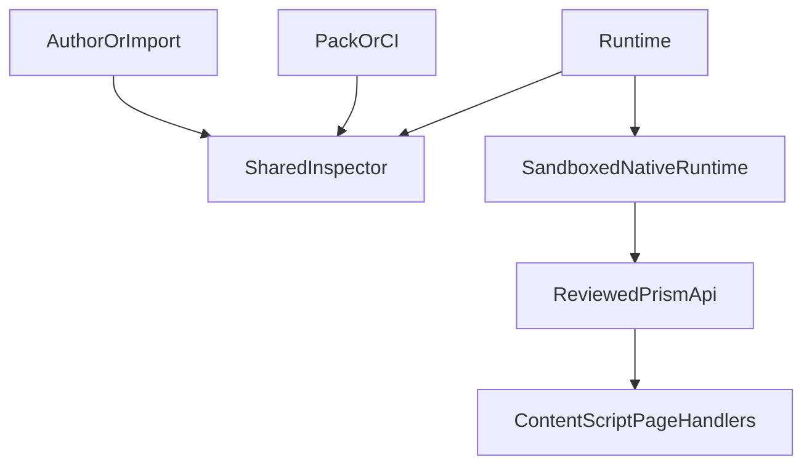

# Mod policy layers

## Goal

Prism treats every mod as untrusted, including local packages and packages
written or built with an AI agent. The extension uses three independent
enforcement layers:

1. authoring and import diagnostics,
2. pack and CI refusal,
3. runtime inspection, capability gating, and DOM isolation.

The layers share policy definitions, but each boundary invokes them again.
Passing one layer is never a trust token for a later layer.

## Local flow

The content script owns the page DOM and browser APIs. Native mod code receives
only the `prism.*` API and validated semantic data. It never receives
`document`, `window`, page HTML, cookies, `chrome`, or an unrestricted network
primitive.

## Shared inspector

`packages/schema` exposes `inspectPackage`. It reports structured findings with
a severity and file path, and returns `ok: false` when any finding is an error.
The inspector accepts the package file map and manifest. It is used by:

- author/import to show findings and refuse an invalid import;
- `packMod`, bundled-mod generation, and the mods-engine CI gate;
- archive loading and compiled-cache reads;
- runtime activation and CSS or browser-filter application.

The policy is whitelist-first. A new syntax is refused until the corresponding
reviewed capability or safe language feature is added to the allowlist.

## CSS

The compiler strips comments and decodes escapes before policy inspection.
Supported UserCSS document matchers are compiled away. Only approved at-rules,
selectors, and declarations are accepted. Remote resources, imports, update
metadata, script-like declarations, and unsupported CSS are refused. The
`prism.styles.apply` path repeats the check at runtime.

## Browser filters and DNS

v1 supports only browser host-block filters in `filters/browser/`. A non-comment
line must be the approved `||host^` form and compiles to a DNR block rule.
Unknown filter syntax is an error at pack time and cannot add redirects,
header changes, scripts, or other actions at runtime.

DNS and gateway directories are not supported in v1. Their presence is an
error, not ignored input.

## Native JavaScript

Native package source is parsed with the TypeScript compiler API. The accepted
surface is one `activate` export, type-only imports, and calls on the supplied
`prism` parameter using approved language builtins. Page, extension, dynamic
code, worker, storage, and network globals are outside the allowlist.

Userscripts remain a separate, explicitly labelled runtime. `USER_SCRIPT`,
declared scopes, and the no-remote-script rule remain required. Prism does not
claim that userscripts are DOM-safe.

## Runtime behaviour

Capability denials emit a denied activity event and return a safe no-op result.
Required capability grants still gate activation. Optional network capabilities
still require the browser's explicit host permission prompt. Local origin and
local authorship never bypass permissions.

Native activation runs in a sandboxed iframe with scripts enabled but without
same-origin access. A postMessage RPC exposes only reviewed operations. The
iframe has no page DOM and no extension origin. If the isolation mechanism is
unavailable, native JavaScript is refused.

## Community workflow

The future community workflow adds independent scan, run, verify, validate,
secure, and key stages:

- scan source and dependencies, including secrets and provenance;
- run declared fixture and compatibility tests;
- verify immutable content hashes;
- validate manifest, schema, and the local package inspector;
- secure execution with capabilities, DOM isolation, and explicit permissions;
- key publisher and registry metadata with rotation and revocation.

This appendix does not implement a registry, signing service, or hosted
runtime. Phase 10 remains deferred. A future client must verify signatures and
re-run local validation rather than trusting a registry result.
